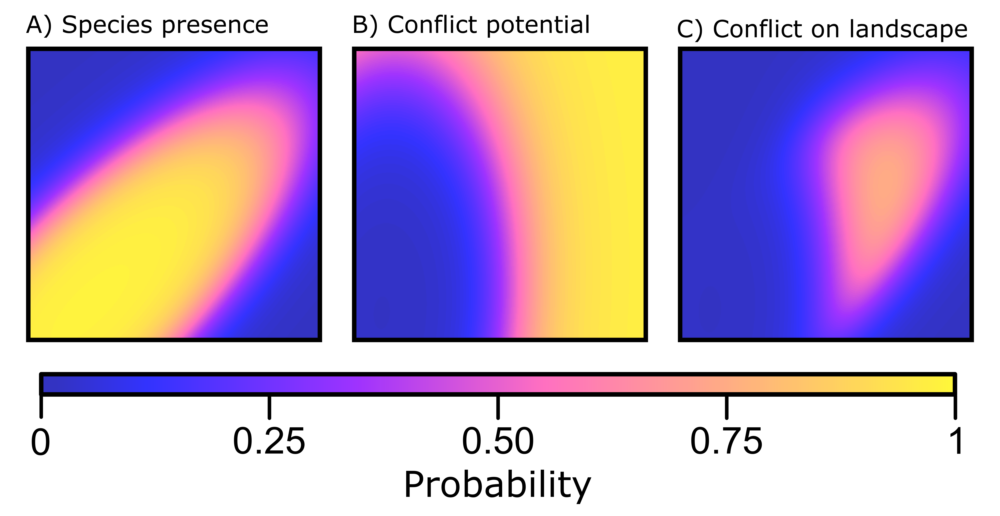

# A repository for:

Fidino, M, Lehrer, E. W., Kay, C. A. M., Yarmey, N., Murray, M. H., Fake, K., Adams, H. C., & Magle, S. B. Integrated species distribution models reveal spatiotemporal patterns of human–wildlife conflict. *Ecological Applications*

## Links to different parts of the readme file

1. [What's in this repository?](#whats-in-this-repository)
2. [What does this model do?](#what-does-this-model-do)
3. [The working directory](#the-working-directory)
4. [The data folder (`./data`)](#the-data-folder-data)
5. [The figures folder (`./figures`)](#the-figures-folder-figures)
6. [The JAGS folder (`./JAGS`)](#the-jags-folder-jags)
7. [The mcmc output folder (`./mcmc_output`)](#the-mcmc-output-folder-mcmc_output)
8. [The R folder (`./R`)](#the-r-folder-r)


## What's in this repository?


This repository stores all of the data and code used to fit the integrated model to the Chicago, Illinois nuisance wildlife complaint data and the camera trap data we collected between 2011 and 2013. The folder organization seperates the data (`./data`),figures from the manuscript (`./figures`), JAGS model (`./JAGS`), the mcmc outputs from the model we fit to the data for coyote, Virginia opossum, and raccoon (`./mcmc_outputs`), and  R code (`./R`).

This document here serves as a road map that describes all of the files present in this repository.


[Back to table of contents ⤒](#a-repository-for)


## What does this model do?

This is a dynamic integrated occupancy that model combines presence-only human-wildlife conflict data with detection/non-detection data from a wildlife survey (e.g,. camera trapping). Doing so allows you to estimate a species distribution (Figure 1A), their conflict potential (Figure 1B), and where conflict actually occurs on the landscape (Figure 1C). This is useful if you are interested in controlling for a species distribution when making predictions about where human-wildlife conflict occurs (which we should be interested in).

<div align="center"></div>

**Figure 1.** A species distribution on the landscape (A), where the species has the greatest likelihood of coming into conflict with humans given their presence across the entire landscape (B), and the expected distribution of where conflict actually occurs on the landscape (C), which is the product of where the species is (A) and where conflict is most likely to occur (B).

</br>

This model, however, is not "new". I have essentially combined the [Koshkina et al. (2017)](https://besjournals.onlinelibrary.wiley.com/doi/full/10.1111/2041-210X.12738) model with the generalized additive model portion of [Rushing et al. (2019)](https://www.nature.com/articles/s41598-019-48851-5). In brief, the latent occupancy probability during each time step has a spatial smoothing term applied (to control for spatiotemporal autocorrelation). Between time periods, the spatial smoothing term at time *t* is partially informed by the spatial smoothing term at time *t-1* (see our paper, or the Rushing et al. paper to see how this works).

[Back to table of contents ⤒](#a-repository-for)

### The working directory

Aside from the aforementioned folders, the working directory here stores the `.gitignore` file for this repository, this README file (`README.md`) the `.Rproj` file (for if you are using RStudio, `conflict.Rproj`), and a single R script (`fit_models.R`).

I have kept this single script outside of the `./R` folder because it would be the one script you need to run if you were interested in fitting the models to these data. On my computer it took a little over a week to run all three of these models. This script 1) iterates through the three species in a `for` loop 2) pulls in the relevant data and format it for analysis 3) fits the JAGS model and 4) saves the mcmc output and make traceplots of all model parameters in the `./mcmc_output` folder. 

[Back to table of contents ⤒](#a-repository-for)

### The data folder (`./data`)

This folder has 6 files and 3 sub-folders.

**`./data/all_raw_layers.RDS`**: This is all of the raw spatial data used in the analysis. It is saved as a raster brick. There are seven covariates included in this raster brick. The resolution of each covariate is scaled for our analysis (i.e., 500 m cells throughout the city of Chicago).

| Covariate  | Type                   | Description                                                                                                                                                                                                                                                                                                                                                       |
|------------|------------------------|-------------------------------------------------------------------------------------------------------------------------------------------------------------------------------------------------------------------------------------------------------------------------------------------------------------------------------------------------------------------|
| `canopy`     | Proportion             | Proportion canopy cover within a 500 m x 500 m cell. Data collected from https://datahub.cmap.illinois.gov/dataset/high-resolution-land-cover-cook-county-2010                                                                                                                                                                                                    |
| `grass`      | Proportion             | Proportion grass cover within a 500 m x 500 m cell. Data collected from https://datahub.cmap.illinois.gov/dataset/high-resolution-land-cover-cook-county-2010                                                                                                                                                                                                     |
| `imperv`     | Proportion             | Proportion impervious cover within a 500 m x 500 m cell. Data collected from https://datahub.cmap.illinois.gov/dataset/high-resolution-land-cover-cook-county-2010                                                                                                                                                                                                |
| `houses`     | density (units km ^-2) | Housing density within a 500 m x 500 m cell. Data collected from http://silvis.forest.wisc.edu/data/housing-block-change/                                                                                                                                                                                                                                         |
| `income`     | U.S. Dollars                 | Median per capita househould income of city blocks interesting with a 500 m x 500 m cell. From the American Community Survey 5-Year Estimates (used "MEDIAN HOUSEHOLD INCOME IN THE PAST 12 MONTHS (IN 2017 INFLATION-ADJUSTED DOLLARS): Median household income in the past 12 months (in 2017 inflation-adjusted dollars): Households -- (Estimate)"            |
| `vacancy`    | count                  | Number of vacant building reports made to the city of Chicago within a 500 m x 500 m block. Data was taken from: https://data.cityofchicago.org/Service-Requests/311-Service-Requests-Vacant-and-Abandoned-Building/d9re-tmpw. "Data set contains all 311 calls for open and vacant buildings reported to the City of Chicago since January 1, 2010".             |
| `dist2water` | meters             | Distance of a 500 m x 500 m cell's centroid to a natural water source. Was initially entertained as a covariate in the model but we decided to remove it. Data comes from https://data.cityofchicago.org/Parks-Recreation/Waterways/eg9f-z3t6. This data layer includes Lake Michigan, Rivers and Lakes, but doesn't include smaller water sources (ponds, etc.). |

And here is what these variables look like plotted out across the city of Chicago.

<div align="center"></div>

**`./data/camera_trap_detections_sp10_sp_13.csv`**: The summarised detection / non-detection camera trap data between April 2010 and April 2013. 

| Column       | Type      | Description                                                                                                                                                                                                                                    |
|--------------|-----------|------------------------------------------------------------------------------------------------------------------------------------------------------------------------------------------------------------------------------------------------|
| `Season`     | Category  | A seasonal code for the season the data comes from. It combines the first two letters of the season and the last two digits of the year. Seasonal codes are SP = Spring, SU = Summer, FA = Fall, WI = Winter. Data collection started in 2010. |
| `Week`       | Category  | The week of sampling. Ranges from Week 1 to Week 4                                                                                                                                                                                             |
| `Date`       | Date      | The sampling day                                                                                                                                                                                                                               |
| `SeasonWeek` | Category  | The Season and Week columns combined                                                                                                                                                                                                           |
| `StationID`  | Category  | The site abbreviation                                                                                                                                                                                                                          |
| `SurveyID`   | Category  | The site abbreviation combined with the season code                                                                                                                                                                                            |
| `IDWeek`     | Character | The survey ID combined with the Date                                                                                                                                                                                                           |
| `Coyote`     | Binary    | Equals 1 if the species was detected at that site on that day, 0 if the camera was active but the species was not detected, and NA if the camera was not operational.                                                                          |
| `Opossum`    | Binary    | Equals 1 if the species was detected at that site on that day, 0 if the camera was active but the species was not detected, and NA if the camera was not operational.                                                                          |
| `Raccoon`    | Binary    | Equals 1 if the species was detected at that site on that day, 0 if the camera was active but the species was not detected, and NA if the camera was not operational.                                                                          |
| `Redfox`     | Binary    | Equals 1 if the species was detected at that site on that day, 0 if the camera was active but the species was not detected, and NA if the camera was not operational.                                                                          |
| `Skunk`      | Binary    | Equals 1 if the species was detected at that site on that day, 0 if the camera was active but the species was not detected, and NA if the camera was not operational. Specifically, this is the striped skunk.                                 |

</br>

**`./data/chicago_variables_raster_500.tif`**: This is the `./data/all_raw_layers.RDS` file except saved as a raster file. See above for all information about the covariates included.
**`./data/fall_2013.csv`**: The summarised detection / non-detection camera trap data for October 2013. Stored in a seperate file because we used a different database for these data.

| Column         | Type     | Description                                                                                                                                               |
|----------------|----------|-----------------------------------------------------------------------------------------------------------------------------------------------------------|
| `CommonName`   | Category | The species the detection record is associated to. Has the same species names as the columns in `./data/camera_trap_detections_sp10_sp13.csv`             |
| `locationAbbr` | Category | The site abbreviation                                                                                                                                     |
| `count`        | Integer  | The number of days a species was detected during sampling. NA if camera was not active. 0 if the species was not detected but the camera was operational. |
| `J`            | Category | The number of days the camera was operational                                                                                                             |

</br>

**`./data/station_coords.csv`**: The coordinates of all the camera trapping locations in UTM (the coordinate reference system is `32616`).

| Column      | Type                | Description          |
|-------------|---------------------|----------------------|
| `StationID` | Category            | The site abbrevation |
| `Northing`  | Coordinate (y-axis) | Northing for a site  |
| `Easting`   | Coordinate (x-axis) | Easting for a site   |

</br>

**`./data/summer_2013.csv`**: The summarised detection / non-detection camera trap data for July 2013. Stored in a seperate file because we used a different database for these data.

| Column         | Type     | Description                                                                                                                                               |
|----------------|----------|-----------------------------------------------------------------------------------------------------------------------------------------------------------|
| `CommonName`   | Category | The species the detection record is associated to. The species names are a little different (and are fixed in `./R/format_data_for_analysis.R`)             |
| `locationAbbr` | Category | The site abbreviation                                                                                                                                     |
| `count`        | Integer  | The number of days a species was detected during sampling. NA if camera was not active. 0 if the species was not detected but the camera was operational. |
| `J`            | Category | The number of days the camera was operational                                                                                                             |
#### The conflict_clean sub-folder (`./data/conflict_clean`):

This stores all of the cleaned and geocoded nuisance wildlife reports between 2011 and 2013. There is a seperate file for each species (`coyote.csv`, `opossum.csv`, and `raccoon.csv`). The format of these three csv files is:

| Column           | Type       | Description                                                                                                   |
|------------------|------------|---------------------------------------------------------------------------------------------------------------|
| `type`           | Category   | The kind of report made (e.g., injured animal, nuisance animal, etc.)                                         |
| `request_number` | Category   | The unique identifying code for each request                                                                  |
| `date`           | Date       | The date of the report. In day-month-year format                                                              |
| `year`           | Year       | The year of the report                                                                                        |
| `month`          | Month      | The month of the report                                                                                       |
| `block`          | Address    | The block address of where the report occurred                                                                |
| `description`    | Text       | A text description of the report                                                                              |
| `lon`            | Coordinate | The longitude of a report (i.e., x-axis), geocoded from the block column. Coordinate reference system = 4326. |
| `lat`            | Coordinate | The Latitude of a report (i.e., y-axis), geocoded from the block column. Coordinate reference system = 4326.  |

#### The conflict_raw sub-folder (`./data/conflict_raw`):

This stores all of the raw nuisance wildlife reports between 2011 and 2013 provided by the city of Chicago. There is a seperate file for each species (`coyote.csv`, `fox.csv`, `opossum.csv`, and `raccoon.csv`). While the fox csv is still here, we decided not to include it in the analysis as data were sparse for the camera trapping and complaint data. These are in a somewhat strange format (e.g., the headers are sometimes three rows down), and is cleaned via `./R/clean_conflicts.R`. Once the headers do start in a file, the columns are:

| Column               | Type     | Description                                                           |
|----------------------|----------|-----------------------------------------------------------------------|
| `Type`               | Category | The kind of report made (e.g., injured animal, nuisance animal, etc.) |
| `Service Request No` | Category | The unique identifying code for each request                          |
| `Created Date`       | Date     | The date of the report. In day-month-year format                      |
| `Created Year`       | Year     | The year of the report                                                |
| `Created Month`      | Month    | The month of the report                                               |
| `Block Address`      | Address  | The block address of where the report occurred                        |
| `Description`        | Text     | A text description of the report                                      |


#### The IL City Shape Files subfolder

This just contains the city outline of Chicago as a shapefile. It is used for plotting purposes.

[Back to table of contents ⤒](#a-repository-for)

### The figures folder (`./figures`)

This folder houses some of the raw figures I generated in `R` (which I cleaned up using Inkscape), as well as other figures that were publication ready. All of the extra "cleaning" I needed to do was related to the maps I had made (there was too much spacing between images).


|File|Description|
|---|---|
|**`./figures/figure_1.pdf`** | Figure 1 in the manuscript, publication ready, which is an example of the modeling framework.|
|**`./figures/figure_1.png`** | Figure 1 as a png so I could use it in this README.md.|
|**`./figures/figure_1.svg`** | Figure 1 as a scaleable vector graphic.|
|**`./figures/figure_2.pdf`** | Figure 2 in the manuscript, publication ready, which shows each species distribution, their conflict potential, and where they are most likely to come in to conflict with humans.|
|**`./figures/figure_2.svg`** | Figure 2 as a scaleable vector graphic.|
|**`./figures/figure_3.tiff`** | Figure 3 in the manuscript, publication ready, which shows the slope terms from the model.|
|**`./figures/figure_4.tiff`** | Figure 4 in the manuscript, publication ready, which shows the conflict potential response for different covariates.|
|**`./figures/rough_1.svg`** | Output from R that was used to generate figure 1.|
|**`./figures/spatial_variables.jpeg`** | Plot of the spatial variables used in the model, used in this README.md.|
|**`./figures/supl_coyote.png`** | Supplemental figure for coyote, which shows their spatiotemporal correlation in occupancy across the 12 seasons of sampling.|
|**`./figures/supl_coyote.svg`** | Same, but as a scaleable vector graphic (output from R).|
|**`./figures/supl_opossum.png`** | Supplemental figure for Virginia opossum, which shows their spatiotemporal correlation in occupancy across the 12 seasons of sampling.|
|**`./figures/supl_opossum.svg`** | Same, but as a scaleable vector graphic (output from R).|
|**`./figures/supl_raccoon.png`** | Supplemental figure for raccoon, which shows their spatiotemporal correlation in occupancy across the 12 seasons of sampling.|
|**`./figures/supl_raccoon.svg`** | Same, but as a scaleable vector graphic (output from R).|
|**`./figures/supl_urb_map.png`** | Supplemental figure for the two urban intensity metrics and the variables that were used to create them.|
|**`./figures/supl_urb_map.svg`** | Same, but as a scaleable vector graphic (output from R).|


[Back to table of contents ⤒](#a-repository-for)

### The JAGS folder (`./JAGS`)

This folder houses one script, which is the `JAGS` model that is fit to the data, which is titled `dynamic_integrated_occupancy_gam.R`. The code is commented out within the model pretty well (I had to write it in a way that was more difficult to read because it ran far faster that way).

[Back to table of contents ⤒](#a-repository-for)

### The mcmc output folder (`./mcmc_output`)

This folder houses the posterior distributions from the models we fit to the data of coyote (`./mcmc_output/coyote_model.RDS`), opossum (`./mcmc_output/opossum_model.RDS`), and  raccoon (`./mcmc_output/raccoon_model.RDS`), which are stored as RDS files. I used `run.jags` to fit the models, so they are `runjags` objects. If you want to grab the posterior distribution from the models it can be done as:

```R
my_model <- readRDS("./mcmc_output/coyote_model.RDS)

my_mcmc <- do.call("rbind", my_model$mcmc)
```

This folder also has a summary of all the parameters as a pdf (which was the supplemental material for the manuscript). There is an R markdown file (`./mcmc_output/Appendix_S1.Rmd`) and the associated PDF that was knitted from it (`./mcmc_output/Appendix_S1.pdf`).

#### The diagnostic plots sub-folder (`./mcmc_output/diagnostic_plots)

This folder has three sub-folders (one for coyote, one for opossum, and one for raccoon). Inside of each of these are the traceplots for each model parameter. They are generated when `fit_models.R` is run.  See `./JAGS/dynamic_integrated_occupancy_gam.R` for where each parameter fits into the model.


#### The validation sub-folder (`./mcmc_output/validation`)

This sub-folder contains the posterior distributions from the models fit to only a portion of the human-wildife conflict data so that we could do some model validation for the coyote (`./mcmc_output/valdiation/coyote_validation_model.RDS`), opossum (`./mcmc_output/valdiation/opossum_validation_model.RDS`), and raccoon (`./mcmc_output/valdiation/raccoon_validation_model.RDS`). There are two other RDS files, which are created via `./R/validate_model.R`, and include `ROC_scores.RDS` and `model_auc.RDS`. The former is a list object of length three (one element for each species) that contains the ROC scores for each potential threshold and sampling period. The latter is also a list object of length three (one element for each species) that summarises the AUC scores. Each element is also a list and contains the global AUC across the whole study (e.g., `model_auc$coyote$auc_global`), for each sampling period (e.g.,`model_auc$coyote$auc_year`), as well as the true positive rate (tpr), false positive rate (fpr), and accuracy (acc) for each threshold and sampling period. We used 41 threshold values, evenly spaced between 0 and 1.

[Back to table of contents ⤒](#a-repository-for)

### The R folder (`./R`)

This folder has 12 R scripts, plus an additional sub-folder titled `./R/functions` that contains 2 seperate scripts of different functions for running the analysis or plotting the results.

| File                                 | Description                                                                                                                                                                                                                                                                                                                                                            |
|--------------------------------------|------------------------------------------------------------------------------------------------------------------------------------------------------------------------------------------------------------------------------------------------------------------------------------------------------------------------------------------------------------------------|
| **`./R/Appendix_S2.Rmd`**          | A markdown file to create Appendix S2 for this manuscript. It houses the model validation results. |
| **`./R/clean_conflicts.R`**          | This script goes through the raw conflict files in `./data/conflict_raw` and uses regular expressions to query nuisance wildlife reports where the species ID may be uncertain. It then loops through the descriptions of each offending report and prints out the description tied to the report (and allows the user to determine if the report should be censored). |
| **`./R/figure1.R`**                  | The script I wrote to create the first figure in the manuscript.                                                                                                                                                                                                                                                                                                       |
|**`./R/fit_models_validation.R`**                  | The script used to fit the models to a subset of the data for validation purposes. Similar to `fit_models_validation.R`.                                                                                                                                                                                                                                                                                                     |
| **`./R/format_data_for_analysis.R`** | The main workhorse of this project. All of the data is pulled in with this script and it gets formatted and made ready to fit into a JAGS model. The main outputs from this are `data_list`, which is the list object supplied to `JAGS`, as well as the `my_inits()` function, which supplies initial values to JAGS. It's commented out as well.                     |
| **`./R/format_data_for_validation.R`** | Similar to `./R/format_data_for_analysis.R` expect it subsets the data before fitting the model.                     |
|**`./R/geocode_conflicts.R`**        | Once `./R/clean_conflicts.R` has been ran, this is the script that will take the block-level address and geocode it to latitude and longitude.                                                                                                                                                                                                                         |
| **`./R/plots_models.R`**             | The script I wrote to make the rest of the figures for this manuscript. `./R/format_data_for_analysis.R` still gets ran as it provides a lot of the spatial data we need for making maps.                                                                                                                                                                              |
| **`./R/sourcer.R`**                  | A script that just sources all of the functions in `./R/functions`. That way I can just call `source(./R/sourcer.R)` instead of sourcing each file in that folder.                                                                                                                                                                                                     |
| **`./summarise_high_res_lulc.R`**    | The spatial environmental data we used had sub-meter resolution, which we needed to aggregate up to 500 meters for this analysis. This script does that aggregration and prepares the environmental data layers for statistical analysis.                                                                                                                              |
 |**`./URB_PCA_plot.R`**    | Used to create a rough draft of Appendix S1: Fig S1|
 |**`./validate_model.R`**    | Calculates the AUC from the posterior distributions created via `./R/fit_models_validation.R`|

#### The functions sub-folder (`./R/functions`)

This sub-folder houses a bunch of custom functions I wrote to streamline this project. I've commented out all of the functions and their arguments in the scripts themselves, so I leave those who are interested in what functions are there to explore the scripts themselves. The two scripts here are`./R/functions/plot_utility.R`, which houses a lot of the functions I used to make the figures for the project, and `./R/functions/utility_script.R`, which was a catchall for non-plot related functions.


[Back to table of contents ⤒](#a-repository-for)


