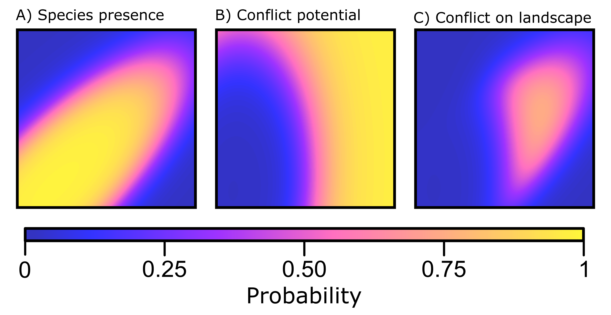

# A repository for:

Fidino, M, Lehrer, E. W., Kay, C. A. M., Yarmey, N., Murray, M. H., Fake, K., Adams, H. C., & Magle, S. B. Combining nuisance wildlife reports with wildlife monitoring data to estimate the probability of human-wildlife conflict relative to a species’ underlying distribution.

## What does this model do?

This is a dynamic integrated occupancy that model combines presence-only human-wildlife conflict data with detection/non-detection data from a wildlife survey (e.g,. camera trapping). Doing so allows you to estimate a species distribution (Figure 1A), their conflict potential (Figure 1B), and where conflict actually occurs on the landscape (Figure 1C). This is useful if you are interested in controlling for a species distribution when making predictions about where human-wildlife conflict occurs (which we should be interested in).

Figure 1. A species distribution on the landscape (A), where the species has the greatest likelihood of coming into conflict with humans given their presence across the entire landscape (B), and the expected distribution of where conflict actually occurs on the landscape (C), which is the product of where the species is (A) and where conflict is most likely to occur (B).

This model, however, is not "new". I have essentially combined the [Koshkina et al. (2017)](https://besjournals.onlinelibrary.wiley.com/doi/full/10.1111/2041-210X.12738) model, with the generalized additive model portion of of [Rushing et al. (2019)](https://www.nature.com/articles/s41598-019-48851-5). In brief, the latent occupancy probability during each time step has a spatial smoothing term applied (to control for spatial autocorrelation). Between time periods, the spatial smoothing term at time *t* is partially informed by the spatial smoothing term at time *t-1* (see our paper, or the Rushing et al. paper to see how this works).

---

## What's in this repository?

This repository stores all of the data and code used to fit the integrated model to the Chicago, Illinois nuisance wildlife complaint data and the camera trap data we collected between 2011 and 2013.

Right now the associated scripts on this repo will simulate and analyze presence-only data with detection / non-detection data from planned surveys. Models to estimate the set parameter values from the simulated data are written in `JAGS`. 

After cloning the repository all you will need to open up is the `simulate_poisson_process.R` script and run through it. The integrated model does take some time to run.
