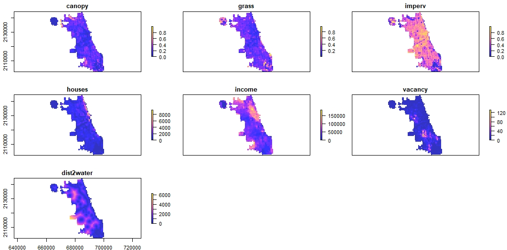

# A repository for:

Fidino, M, Lehrer, E. W., Kay, C. A. M., Yarmey, N., Murray, M. H., Fake, K., Adams, H. C., & Magle, S. B. Combining nuisance wildlife reports with wildlife monitoring data to estimate the probability of human-wildlife conflict relative to a species’ underlying distribution.

## What does this model do?

This is a dynamic integrated occupancy that model combines presence-only human-wildlife conflict data with detection/non-detection data from a wildlife survey (e.g,. camera trapping). Doing so allows you to estimate a species distribution (Figure 1A), their conflict potential (Figure 1B), and where conflict actually occurs on the landscape (Figure 1C). This is useful if you are interested in controlling for a species distribution when making predictions about where human-wildlife conflict occurs (which we should be interested in).

Figure 1. A species distribution on the landscape (A), where the species has the greatest likelihood of coming into conflict with humans given their presence across the entire landscape (B), and the expected distribution of where conflict actually occurs on the landscape (C), which is the product of where the species is (A) and where conflict is most likely to occur (B).

This model, however, is not "new". I have essentially combined the [Koshkina et al. (2017)](https://besjournals.onlinelibrary.wiley.com/doi/full/10.1111/2041-210X.12738) model, with the generalized additive model portion of of [Rushing et al. (2019)](https://www.nature.com/articles/s41598-019-48851-5). In brief, the latent occupancy probability during each time step has a spatial smoothing term applied (to control for spatial autocorrelation). Between time periods, the spatial smoothing term at time *t* is partially informed by the spatial smoothing term at time *t-1* (see our paper, or the Rushing et al. paper to see how this works).

## What's in this repository?

This repository stores all of the data and code used to fit the integrated model to the Chicago, Illinois nuisance wildlife complaint data and the camera trap data we collected between 2011 and 2013. The folder organization seperates the data (`./data`),figures from the manuscript (`./figures`), JAGS model (`./JAGS`), the mcmc outputs from the model we fit to the data for coyote, Virginia opossum, and raccoon (`./mcmc_outputs`), and  R code (`./R`).

This document here serves as a road map that describes all of the files present in this repository.

#### The working directory

Aside from the aforementioned folders, the working directory here stores the `.gitignore` file for this repository, this README file (`README.md`) the `.Rproj` file (for if you are using RStudio, `conflict.Rproj`), and a single R script (`fit_models.R`).

I have kept this single script outside of the `./R` folder because it would be the one script you need to run if you were interested in fitting the models to these data. On my computer it took a little over a week to run all three of these models. This script 1) iterates through the three species in a `for` loop 2) pulls in the relevant data and format it for analysis 3) fits the JAGS model and 4) saves the mcmc output and make traceplots of all model parameters in the `./mcmc_output` folder. 

#### The data folder (`./data`)

This folder has 6 files and 2 sub-folders.

- **`./data/all_raw_layers.RDS`**: This is all of the raw spatial data used in the analysis. It is saved as a raster brick. There are seven covariates included in this raster brick. The resolution of each covariate is scaled for our analysis (i.e., 500 m cells throughout the city of Chicago).

| Covariate  | Type                   | Description                                                                                                                                                                                                                                                                                                                                                       |
|------------|------------------------|-------------------------------------------------------------------------------------------------------------------------------------------------------------------------------------------------------------------------------------------------------------------------------------------------------------------------------------------------------------------|
| canopy     | Proportion             | Proportion canopy cover within a 500 m x 500 m cell. Data collected from https://datahub.cmap.illinois.gov/dataset/high-resolution-land-cover-cook-county-2010                                                                                                                                                                                                    |
| grass      | Proportion             | Proportion grass cover within a 500 m x 500 m cell. Data collected from https://datahub.cmap.illinois.gov/dataset/high-resolution-land-cover-cook-county-2010                                                                                                                                                                                                     |
| imperv     | Proportion             | Proportion impervious cover within a 500 m x 500 m cell. Data collected from https://datahub.cmap.illinois.gov/dataset/high-resolution-land-cover-cook-county-2010                                                                                                                                                                                                |
| houses     | density (units km ^-2) | Housing density within a 500 m x 500 m cell. Data collected from http://silvis.forest.wisc.edu/data/housing-block-change/                                                                                                                                                                                                                                         |
| income     | median                 | Median per capita househould income of city blocks interesting with a 500 m x 500 m cell. From the American Community Survey 5-Year Estimates (used "MEDIAN HOUSEHOLD INCOME IN THE PAST 12 MONTHS (IN 2017 INFLATION-ADJUSTED DOLLARS): Median household income in the past 12 months (in 2017 inflation-adjusted dollars): Households -- (Estimate)"            |
| vacancy    | count                  | Number of vacant building reports made to the city of Chicago within a 500 m x 500 m block. Data was taken from: https://data.cityofchicago.org/Service-Requests/311-Service-Requests-Vacant-and-Abandoned-Building/d9re-tmpw. "Data set contains all 311 calls for open and vacant buildings reported to the City of Chicago since January 1, 2010".             |
| dist2water | Character              | Distance of a 500 m x 500 m cell's centroid to a natural water source. Was initially entertained as a covariate in the model but we decided to remove it. Data comes from https://data.cityofchicago.org/Parks-Recreation/Waterways/eg9f-z3t6. This data layer includes Lake Michigan, Rivers and Lakes, but doesn't include smaller water sources (ponds, etc.). |

And here is what these variables look like plotted out across the city of Chicago.

